## 🌌 MemeCore Universal Warp Gate & Yield Hub

**“Unlocking the Value of Memecoins: The Ultimate DeFi Layer.”**  
솔라나, 베이스, 트론 등 파편화된 밈코인 유동성을 MemeCore 메인넷으로 끌어와  
**스테이킹 기반 이자(Yield)** 를 생성하는 크로스체인 금융 허브입니다.

---

### 1. 📖 프로젝트 개요 (Why This Project?)

#### 1-1. 문제 정의 – “유동성은 넘치지만, 생산성은 없다”

- **밈코인 시장 규모**  
  - 2025년 기준 밈코인(Memecoin) 섹터는 전체 암호화폐 시총의 **약 7%** 를 차지할 정도로 커졌습니다.  
  - Solana 체인에서는 **하루 1만 개** 수준의 신규 토큰이 쏟아집니다.
- **하지만 대부분은 Zero-Yield 자산**
  - 비트코인 회전율: 약 **1.8%**
  - 밈코인 회전율: 약 **77%**
  - → 밈코인 보유자는 토큰을 **DeFi에 생산적으로 넣지 않고**,  
    단기 투기 혹은 그냥 “지갑에 방치”하는 경우가 대부분입니다.

즉, **대부분의 밈코인은 “Zero-Yield(무수익)” 자산**입니다.

#### 1-2. 솔루션 – MemeCore를 밈코인의 “금융 수도”로

**MemeCore Warp Gate** 는 외부 체인(예: Solana, Base, Tron 등)에 고립된 밈코인 유동성을  
**MemeCore 메인넷으로 브릿지 → 예치(Stake) → Validator 수익 분배**까지 이어주는 레이어입니다.

- 단순 자산 이동이 아닌, **“수익 창출 허브와 MemeCore 의 아이덴티티 정립”** 입니다.
- 사용자는:
  1. Solana 등 L1에서 밈코인을 **Vault 지갑으로 전송 (Bridge In)**
  2. MemeCore에서 해당 자산의 **M-Token (Wrapped ERC20)** 수령
  3. M-Token 을 `MemeCoreStaking` 에 스테이킹
  4. **네트워크 밸리데이터 수익(가스 수수료) + 생태계 리워드**를 일일 분배 형태로 수령

👉 결과적으로, **“밈코인을 들고만 있어도 수익이 쌓이는 구조, MemeCore 메인넷의 밈코인 커뮤니티 인지도 향상을”**  만드는 것이 프로젝트의 핵심 목표입니다.

동시에, MemeCore 네트워크 레벨에서는 다음과 같은 효과를 노립니다.

- **TVL 증가**  
  - 외부 체인 밈코인이 Vault → M-토큰으로 전환되어 MemeCore 상 TVL 이 자연스럽게 커집니다.
  - MemeCore 생태계 전체의 온체인 자산 규모가 확대되고, 디파이/프로토콜 연계 여지가 늘어납니다.
- **TPS / 온체인 Activity 증가**  
  - 브릿지 민팅/번, 스테이킹/언스테이킹, 보상 청구 트랜잭션이 상시 발생하여  
    MemeCore 블록체인 자체의 트랜잭션 처리량과 활성도가 함께 상승합니다.
- **브랜드 정체성 강화**  
  - “**MemeCore = 밈코인 수익/스테이킹 허브**” 라는 포지셔닝을 통해,  
    단순 L1 을 넘어 밈코인 커뮤니티의 거점 체인으로서의 이미지를 구축합니다.
- **MemeCore의 미래 지향점**  
  - 이 프로젝트는 MemeCore를 “밈코인 생태계의 금융 수도”로 만들기 위한 첫 단계입니다.  
  - 크로스체인 유동성과 지속 가능한 수익 모델을 결합해, 네트워크 장기 성장 동력을 확보하는 것을 목표로 합니다.

---

### 2. 🏛️ 전체 아키텍처 (Architecture)

본 프로젝트는 **On-chain (Solidity) + Off-chain (Node.js)** 하이브리드 구조입니다.

- **On-chain (MemeCore EVM)**  
  - `BridgeFactory` – 크로스체인 랩핑/언랩핑 게이트웨이 (EIP-1167 Minimal Proxy 기반)
  - `BridgeWrappedToken` – Solana SPL → EVM ERC20 로 랩핑된 자산 (M-Token)
  - `MemeCoreStaking` – 단일 풀 기반 스테이킹 및 현금흐름(Validator 수익) 분배

- **Off-chain**
  - **Relay Server (Node.js)**  
    - Solana Vault 지갑 입금 모니터링 (RPC Polling)  
    - `BridgeFactory.mintFromSolana` / `burnForSolana` 호출  
    - Mock Oracle, 보상 분배 스케줄링, API 서버

#### 2-1. 시퀀스 다이어그램 (Mermaid)

```mermaid
sequenceDiagram
    autonumber
    participant User as 👤 User (Frontend)
    participant Solana as 🟣 Solana (L1)
    participant Relay as 🖥️ Relay Server (Node.js)
    participant Factory as 🏭 BridgeFactory (MemeCore)
    participant MToken as 🪙 WrappedToken (M-Token)
    participant Staking as 🏦 Staking Contract

    rect rgb(20, 20, 40)
        note right of User: [Process 1] Bridge In (Solana -> MemeCore)
        User->>Solana: 1. SPL 토큰 전송 (To: Vault Wallet)
        Relay->>Solana: 2. 입금 모니터링 (RPC Polling)
        Relay->>Relay: 3. 입금 확인 및 검증
        Relay->>Factory: 4. mintFromSolana()
        alt 신규 토큰인 경우
            Factory->>MToken: 5a. Clone & Initialize (새 랩핑 토큰 생성)
        else 기존 토큰인 경우
            Factory->>MToken: 5b. Mint (기존 랩핑 토큰 발행)
        end
        MToken-->>User: 6. M-Token 수령
    end

    rect rgb(30, 20, 20)
        note right of User: [Process 2] Staking & Rewards
        User->>MToken: 7. Approve
        User->>Staking: 8. stake(amount)
        Relay->>Staking: 9. (스케줄러/스크립트) distributeDailyRewards()
        note right of Staking: 밸리데이터 수익 분배
        User->>Staking: 10. claimRewards()
        Staking-->>User: 11. 네이티브 M 보상 수령
    end

    rect rgb(20, 40, 20)
        note right of User: [Process 3] Bridge Out (MemeCore -> Solana)
        User->>Relay: 12. Unwrap 요청 (서명 포함)
        Relay->>Relay: 13. 서명 검증 (ethers.verifyMessage)
        Relay->>Factory: 14. burnForSolana()
        Factory->>MToken: 15. Burn (M-Token 소각)
        Relay->>Solana: 16. SPL 토큰 전송 (From: Vault -> User)
        Solana-->>User: 17. Solana 지갑으로 자산 반환
    end
```



---

### 3. 🔍 온체인 컨트랙트 상세 (On-chain)

아래 설명은 실제 레포의 `contracts/BridgeFactory.sol`, `BridgeWrappedToken.sol`, `MemeCoreStaking.sol` 구현을 기준으로 합니다.

#### 3-1. `BridgeFactory.sol` – Universal Warp Gate

- **역할**: 다양한 Solana 밈코인을 MemeCore 네트워크의 M-Token 으로 **랩핑/언랩핑**하는 게이트웨이

- **핵심 상태값**
  - `address public immutable tokenImplementation;`  
    - `BridgeWrappedToken` 구현체 주소 (모든 프록시의 delegatecall 대상)
  - `mapping(bytes32 => address) public solMintToWrapped;`  
    - `solMintHash = keccak256(abi.encodePacked(solanaMint))` 를 key 로 사용하는 Mint → 랩핑 토큰 주소 매핑
  - `mapping(bytes32 => uint8) public solMintDecimals;`  
    - 각 Solana Mint 의 `decimals` 를 저장 (잘못된 decimals 로 브릿지하는 사고 방지)

- **이벤트**
  - **`WrappedTokenDeployed`**  
    - 특정 Solana Mint 가 처음 브릿지될 때, 해당 Mint 전용 랩핑 토큰 프록시가 생성되면 발생
  - **`BridgedFromSolana`**  
    - Solana → MemeCore 브릿지(mint)가 일어날 때마다 발생

- **주요 함수**

  - **`constructor(address _tokenImplementation)`**
    - `BridgeWrappedToken` 구현체 주소를 immutable 로 저장
    - `Ownable(msg.sender)` 로 배포자를 오너로 설정

  - **`getWrappedToken(bytes32 solMintHash)`**
    - 외부에서 (프론트/서버) **“이 Mint 는 이미 브릿지된 적 있는가?”** 를 체크할 때 사용하는 view 함수

  - **`mintFromSolana(...)` (onlyOwner)**  
    - 호출 주체: **릴레이 서버의 EVM 지갑(Validator)**  
    - 로직 개요:
      1. `solMintHash` 로 기존 랩핑 토큰 주소 조회
      2. 없으면 `Clones.clone(tokenImplementation)` 으로 새 프록시 생성
      3. `BridgeWrappedToken.initialize(name, symbol, solanaMint, decimals, bridge, owner)` 호출
      4. `solMintDecimals` 에 decimals 기록 및, 이후 호출 시 **decimals 일관성 검증**
      5. `BridgeWrappedToken(wrapped).mint(to, amount)` 실행
    - 모든 mint/burn 은 **서버의 onlyOwner 권한**을 통해서만 일어납니다.

  - **`burnForSolana(bytes32 solMintHash, address from, uint256 amount)` (onlyOwner)**  
    - 호출 주체: **릴레이 서버**  
    - 역할: MemeCore → Solana 언랩 시, 사용자의 M-Token 을 **안전하게 소각**  
    - 오프체인에서 `ethers.verifyMessage` 로 사용자의 서명을 검증한 뒤,  
      검증된 `from` 주소와 `amount` 를 사용해 `BridgeWrappedToken(wrapped).burn(from, amount)` 호출.

#### 3-2. `BridgeWrappedToken.sol` – Wrapped Asset

- **역할**: Solana SPL 토큰을 MemeCore 상에서 표현하는 **ERC20 랩핑 토큰(M-Token)** 구현체

- **주요 상태값**
  - `address public bridge;` – 유일하게 mint/burn 권한을 가진 Bridge (보통 BridgeFactory)
  - `string public solanaMint;` – 원본 SPL Mint 주소(Base58 문자열)
  - `_customName`, `_customSymbol`, `_customDecimals` – 프록시 초기화용 메타데이터
  - `bool private _initialized;` – `initialize` 가 한 번만 실행되도록 보장

- **보안 제어**
  - `modifier onlyBridge`  
    - `mint`, `burn` 은 모두 **onlyBridge** 로 보호  
    - 오너 포함 누구도 직접 발행/소각 불가 → **BridgeFactory 단일 게이트**를 강제

- **주요 함수**

  - **`constructor()`**
    - 구현체 수준에서의 더미 생성자 (프록시에서는 호출되지 않음)

  - **`initialize(...)`**
    - EIP-1167 프록시 초기화용 함수
    - `_initialized == false` 인지 검사 → 재초기화 방지
    - 이름/심볼/decimals/Solana Mint/Bridge/Owner 를 한 번에 세팅

  - **`name()`, `symbol()`, `decimals()` override**
    - 표준 ERC20 인터페이스를 유지하면서, 프록시 패턴에 맞춰 `_custom*` 필드 반환

  - **`mint(address to, uint256 amount)` / `burn(address from, uint256 amount)`**
    - 오직 `bridge` 주소만 호출 가능 (`onlyBridge`)
    - 실제 ERC20 `_mint`, `_burn` 을 래핑하여 사용

#### 3-3. `MemeCoreStaking.sol` – Yield Engine

- **역할**: M-Token 을 스테이킹하고, 밸리데이터 수익(네이티브 M)을 **공정하게 분배**하는 단일 풀

- **핵심 상태값**
  - `IWrappedToken public mxToken;` – 스테이킹 대상 토큰 (M-Token)
  - `struct StakerInfo { stakedAmount, stakedValueUSD, lastClaimTime, accumulatedRewards, rewardDebt, isUnstaking }`
  - `mapping(address => StakerInfo) public stakers;`
  - `uint256 public totalStakedAmount;`
  - `uint256 public currentTokenPriceUSD;` – 8 decimals
  - `uint256 public rewardPerShare;` – 1e18 스케일의 누적 보상 지수

- **알고리즘**
  - MasterChef(SushiSwap) 스타일의 **`rewardPerShare / rewardDebt`** 구조를 사용하여  
    **O(1)** 복잡도로 각 사용자의 pending reward 를 계산.

- **주요 함수**

  - **`updatePrice(uint256 _priceUSD)` (onlyOwner)**  
    - 릴레이 서버(Oracle 역할)가 `.env` 의 `FAKE_PRICE` 값을 기반으로 호출  
    - UI에서 TVL/예상 수익 계산에 사용

  - **`distributeDailyRewards()` (payable, onlyOwner)**  
    - Validator/Owner 가 `msg.value` 만큼 네이티브 M 을 풀에 입금  
    - `rewardPerShare += (msg.value * 1e18) / totalStakedAmount;`

  - **`stake(uint256 _amount)` / `requestUnstake()` / `claimRewards()`**
    - 모든 액션 전에 `_updateUserReward(msg.sender)` 를 호출하여  
      지금까지 쌓인 보상을 `accumulatedRewards` 에 반영
    - `claimRewards()` 에서 실제로 네이티브 M 전송
    - `nonReentrant` 로 재진입 공격 방지

---

### 4. 🖥️ 오프체인 구성요소 (Off-chain)

#### 4-1. Relay Server (`relay-server/index.js`)

Solana 와 MemeCore EVM 사이를 연결하는 **중계 노드**입니다.

- **1) Solana Vault 입금 모니터링**
  - `pollSolanaDeposits()`  
    - `getSignaturesForAddress(vault)` 로 최근 트랜잭션 조회
    - 이미 처리한 서명은 `processed-deposits.json` 에 기록하여 **중복 처리 방지**
  - `handleDepositSignature(signature)`  
    - `getParsedTransaction` 으로 SPL 토큰 입금 내역 파싱  
    - Vault 의 토큰 증가분(Delta)을 계산하여 실제 입금량 산출  
    - 해당 Mint 가 `.env` 의 `SOLANA_TOKEN_MINT` 목록에 포함되어 있을 때만 처리  
    - `BridgeFactory.mintFromSolana(...)` 호출로 **M-Token 민팅**

- **2) Reverse Bridge (MemeCore → Solana)**
  - 엔드포인트: `/api/unwrap`
  - 플로우:
    1. 프론트에서 `UNWRAP:amount:solAddr:timestamp` 형식의 메시지를 `signMessage` 로 서명
    2. 서버에서 `ethers.verifyMessage` 로 서명 검증 → `evmAddress` 일치 여부 확인
    3. 사용자의 M-Token 잔고/allowance 확인
    4. `BridgeFactory.burnForSolana(...)` 호출로 소각
    5. `sendSplFromVault(toSolAddress, amount)` 로 Solana Vault → 사용자 지갑으로 SPL 토큰 전송

- **3) Mock Oracle & 보상 분배**
  - `/api/update-price`  
    - `.env` 의 `FAKE_PRICE` 를 사용해 `MemeCoreStaking.updatePrice()` 호출 (on-demand)
  - 일일 보상 분배는 **수동 스크립트**(`scripts/manual-distribute.js`) 와  
    `npm run set-distribute`, `npm run distribute -- <amount>` 으로 호출.

- **4) 간단 Web 서버 + API**
  - 정적 파일: `relay-server/public/index.html`, `app.js`, `style.css` 서빙
  - `/api/set-dest-address` : 브릿지 인 시 목적지 EVM 주소 설정
  - `/api/confirm-bridge` : 특정 Solana 트랜잭션이 브릿지 처리되었는지 확인

#### 4-2. Frontend (`relay-server/public/index.html`, `app.js`, `style.css`)

- **단일 페이지(SPA)** 형태로 **Bridge + Staking + Live Dashboard** 제공
- **주요 특징**
  - **Retro Pixel UI & 네트워크 티커**
    - 실시간 블록 높이, TPS 추정, 일일 리워드 풀 추정치 애니메이션 표시 실시간 블록 진행을 게이지 형태로 구현
  - **멀티 월렛 연결**
    - Phantom (Solana)
    - MetaMask (MemeCore EVM)
  - **Bridge 탭**
    - INBOUND (SOL → EVM): Vault 로 SPL 전송 후, M-Token 수령
    - OUTBOUND (EVM → SOL): `UNWRAP` 서명 → M-Token 소각 → Solana 로 환불
  - **Staking 탭**
    - 지갑 내 M-Token 잔고, 스테이킹 수량, TVL, 내 지분 %, 예상 일일 리워드, Pending Reward 표시
    - `Approve & Stake`, `Unstake All`, `Claim` 버튼 제공

---

### 5. 💻 설치 & 실행 방법 (Getting Started)

#### 5-1. 사전 요구 사항

- **Node.js** v16 이상
- **npm**
- 브라우저 확장:
  - Phantom Wallet (Solana Devnet)
  - MetaMask (MemeCore Formicarium Testnet)

#### 5-2. 환경 변수 설정 (`.env`)

루트 디렉토리에 `.env` 파일을 생성하고, 아래 예시를 참고해 값을 채웁니다.  
(`.env.example` 도 함께 제공됩니다)

```env
# --- Solana Config ---
SOLANA_RPC=https://api.devnet.solana.com
SOLANA_WALLET_PRIVATE_KEY=<YOUR_PHANTOM_PRIVATE_KEY>
SOLANA_VAULT_ADDRESS=<YOUR_SOLANA_VAULT_PUBKEY>
SOLANA_TOKEN_MINT=<TARGET_SPL_TOKEN_MINTS>   # 여러 mint 지원 시 콤마 구분

# --- MemeCore Network Config ---
MEMECORE_RPC=https://rpc.formicarium.memecore.net
MEMECORE_CHAIN_ID=43521
MEMECORE_PRIVATE_KEY=<YOUR_EVM_PRIVATE_KEY>
VALIDATOR_PRIVATE_KEY=<YOUR_RELAY_KEY>       # 보상/브릿지 트랜잭션에 사용
DEFAULT_MEMECORE_ADDRESS=0x<기본 브릿지 목적지 주소>

# --- Contracts (배포 후 채움) ---
BRIDGE_FACTORY_ADDR=
STAKING_CONTRACT_ADDR=

# --- Relay Settings ---
FAKE_PRICE=1.5  # 테스트용 Mock Oracle 가격(USD)
```

#### 5-3. 의존성 설치

```bash
npm install
```

#### 5-4. 컨트랙트 배포 (Hardhat)

- **1) BridgeWrappedToken 구현체 + BridgeFactory 배포**

```bash
# 스크립트 직접 실행
npx hardhat run scripts/deploy.js

# 또는 package.json 에 정의된 스크립트 사용
npm run deploy-memecore
```

- 콘솔에 출력되는:
  - `BridgeWrappedToken implementation deployed to: 0x...`
  - `BridgeFactory deployed to: 0x...`  
  값을 `.env` 의 `BRIDGE_FACTORY_ADDR` 로 복사합니다.

- **2) 스테이킹 컨트랙트 배포**

```bash
npx hardhat run scripts/deploy-staking.js
# 또는
npm run deploy-staking
```

- 이 스크립트는 내부에서:
  - `.env` 의 `SOLANA_TOKEN_MINT` 중 첫 번째 Mint 를 `keccak256`  
  - `BridgeFactory.solMintToWrapped` 로 해당 Mint 전용 랩토큰 주소 조회
  - 그 주소를 `_mxToken` 으로 사용해 `MemeCoreStaking` 배포
- 출력된 `MemeCoreStaking` 주소를 `.env` 의 `STAKING_CONTRACT_ADDR` 로 복사합니다.

> **Tip:** 스테이킹 컨트랙트는 현재 **대표 Mint(배열의 첫 번째)** 전용입니다.  

#### 5-5. 릴레이 서버 & 웹 UI 실행

```bash
npm run start-relay
```

- Oracle 엔드포인트, 브릿지 폴링, HTTP 서버가 한 프로세스에서 실행됩니다.
- 콘솔에 대략 다음과 같은 로그가 뜹니다.
  - `Relay server started (RPC-based BridgeFactory). Web UI: http://localhost:3000`

브라우저에서 `http://localhost:3000` 접속 후:

- **Bridge 탭** – Solana ↔ MemeCore 브릿지
- **Staking 탭** – M-Token 스테이킹, 언스테이킹, 보상 청구

### 5. 🗺️ 사용 플로우 예시 (End-to-End Flow)

#### 5-1. Solana → MemeCore 브릿지 인

1. Phantom 지갑 연결
2. **Bridge 탭**에서:
   - INBOUND 모드 선택
   - 전송할 SPL 토큰 Mint / 수량 / 목적지 EVM 주소 입력
3. `INITIATE WARP` 클릭 후 Phantom 에서 전송 서명
4. 릴레이 서버가 Solana Vault 입금을 감지 → `mintFromSolana` 호출
5. 지정한 EVM 주소로 **M-Token 입금 완료**

#### 5-2. M-Token 스테이킹 & 보상 수령

1. MetaMask 를 MemeCore Formicarium Testnet 에 연결  
   (필요 시, UI 의 “Switch Network to MemeCore Testnet” 버튼으로 네트워크 추가)
2. **Staking 탭**에서:
   - 스테이킹할 수량 입력 → `APPROVE & STAKE`
3. Validator/Owner 가 필요 시 `npm run set-distribute` / `npm run distribute -- <amount>` 실행
4. 사용자는 언제든 **`CLAIM` 버튼**으로 네이티브 M 보상을 수령

#### 5-3. MemeCore → Solana 브릿지 아웃

1. **Bridge 탭**에서 OUTBOUND 모드 선택
2. Solana 수신 지갑 주소 + 언랩할 M-Token 수량 입력
3. MetaMask 에서 `UNWRAP:amount:solAddr:timestamp` 메시지 서명
4. 릴레이 서버:
   - 서명 검증 → `burnForSolana` 호출로 M-Token 소각
   - `sendSplFromVault` 로 Solana Vault → 사용자 Solana 지갑으로 SPL 토큰 전송
5. Phantom 지갑에서 원래 SPL 토큰 수령

---

### 6. 🗺️ 로드맵 (Future Roadmap)

- **🚀 Phase 2: Native Boost**
  - MemeCore 네이티브 밈코인에 대해 **부스트 멀티플라이어(+10~30%)** 적용

- **🌐 Phase 3: Multi-Chain Expansion**
  - 현재 MVP 는 **Solana ↔ MemeCore** 에 포커스
  - `BridgeFactory` 구조상, Base / Tron / Ethereum / BNB 등으로 확장 용이  
  - 체인 별 Mint 식별자를 `bytes32` 로 추상화하여 확장성 확보

- **🛡️ Phase 4: 완전 탈중앙화 브릿지**
  - 단일 릴레이 서버 → **MPC & 탈중앙 Oracle 네트워크** 로 대체
  - 다중 서명 / CCIP(Chainlink Cross-Chain Interoperability Protocol) 등과 연계하여  
    신뢰 최소화 브릿지 방향으로 진화
